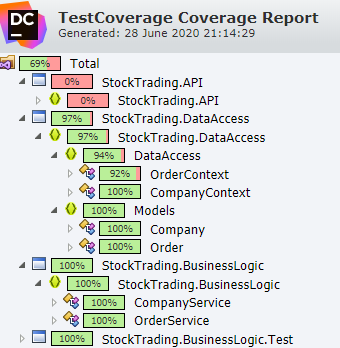

# Coding Challenge

This coding challenge is a RESTful API based coding challenge written in C#. The specification of the challenge can be found [here](Challenge.md). _([source](https://github.com/blackfinch-devops/Test-Api/blob/ef2147b3446afbc3ab4476bd1bdf40c8e3459e26/README.md))_

## Assumptions made

- There is no concept of a user. Orders placed are anonymous and individual transactions are not recorded.
- When a company issues shares, it's simple an abstraction of a 'sell' order where the minimum and maximum price are the same.
- When a company issues shares, other previous orders are not adjusted for inflation.
- When an order is matched, the price does not matter, so long as the minimum and maximum thresholds overlap.
- There is no complex order matching algorithm. I've assumed it to just fill the orders using the oldest as priority, so long as the price matches.

## Outcomes

### The API Specification Document

Instead of trying to learn a new tool to create the API specification first, I wrote down the design as a series of endpoints and what their models should look like. I tried to use the suggested tool but ended up spending a lot of time trying to learn it so for time's sake, I used [Swashbuckle](https://github.com/domaindrivendev/Swashbuckle.AspNetCore) to generate the API Specification from code and used a [JSON to YAML tool](https://www.json2yaml.com) to convert the schema to YAML.

The API Specification is available [here](API-Specification.yml)

### The .NET Core API

I decided to emulate a real enterprise structure by separating concerns between the data access, business logic and the API into their own projects with their own interfaces to be easily dependency injected and later mocked or interchanged.

The interfaces also allow for easier mocking of each component, for example, if using a real database, the data access layer could be swapped out for an in-memory version.

The example data is inserted when the API starts up using an IHostedService called [DemoDataService](StockTrading.API/DemoDataService.cs).

### Unit Tests

I wrote unit tests for the, arguably, most critical component, the business logic layer.

NUnit 3 was chosen as the testing framework since it's what I'm comfortable with and didn't see any reason to use something different right now.

The format of the tests follow a GivenASituation_ThisActionShouldHappen format.

These tests use a real version of the data access layer but due to it being in-memory, I have left that as acceptable for now. Given more time, I'd have liked to have mocked that out.

The tests score 100% coverage on the business logic, although there are possibly more cases that need to be covered.

A report of the test coverage can be found [here](TestCoverage.zip).

## Problems Encountered

- This challenge was given over a weekend with no contact so could not get in contact to clarify any requirements so assumptions have had to been made. A lack of specific domain knowledge didn't help so there may be inconsistencies between what would happen in real life and this API.

## Future considerations

If I were to continue working on this, I'd do the following:

- **Add data validation to the API**
- Instead of returning null in some cases, I'd throw a custom "NotFound" exception and handle that appropriately (e.g. re-throwing or handling it in the API using a custom exception middleware)
- Ask for clarity on how shares are issued and other questions based on assumptions made previously.
- Write integration tests for the API.
- Unit test the data access layer.
- Understand why orders have min and max prices rather than just a set price.
- Separate the models in the DataAccess layer from those returned from the API (e.g. not returning the Order object)
- Clone objects sent to the DataAccess layer instead of using the existing object
